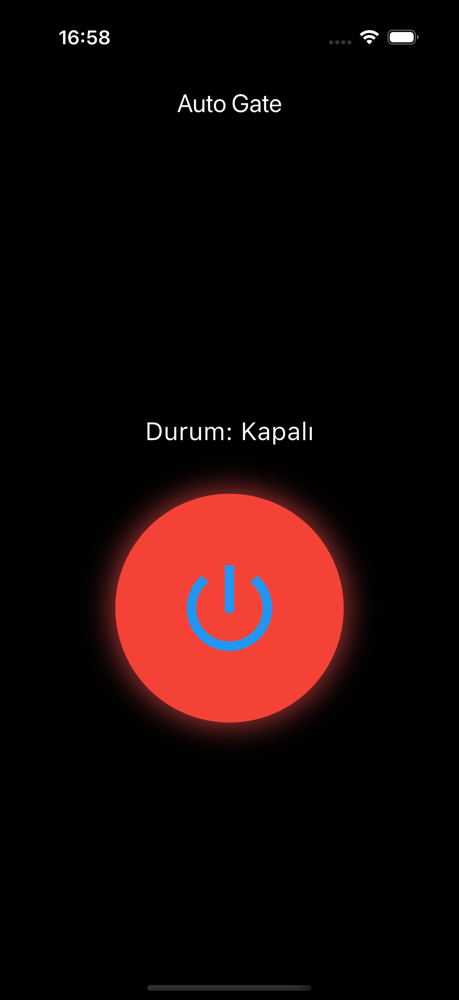

# AutoGate

AutoGate is an IoT-based smart gate control system that allows you to remotely open and close a physical gate using an Arduino board connected to the internet. The mobile app sends commands via HTTP to the Arduino, which then activates a relay to operate the gate mechanism.

## Description

This project combines hardware (Arduino + relay + Wi-Fi module) with a simple mobile app interface to provide secure, wireless control of a gate — ideal for parking lots, private entrances, or automated facility access.

The Arduino listens for HTTP requests and interprets command. The mobile app provides an intuitive interface with button to trigger these actions. No PC or local network is needed after setup; everything runs over the internet.

## Features

- Open and Close gate remotely
- Lightweight mobile interface with one-button control
- HTTP-based communication
- Compatible with most electric gate systems
- Arduino-powered for low cost and reliability

## Components

- ESP32
- Relay module 
- Wi-Fi connectivity  
- Flutter-based mobile app (Android/iOS)

## Communication Flow

1. User presses a button on the mobile app  
2. The app sends an HTTP request to the Arduino’s ip
3. Arduino parses the command and triggers the relay  
4. The gate responds (opens, closes) accordingly

## Application Views

## Notes

- Internet access on Arduino is required (via Wi-Fi)
- For remote access, you may need to configure port forwarding or use services like dynamic DNS
- Optional: Add authentication token to prevent unauthorized access
